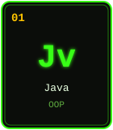
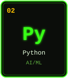
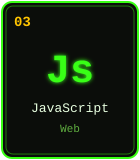
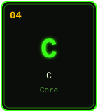
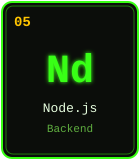
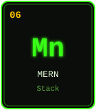
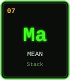
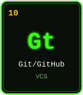

CLASSIFIED SOFTWARE ENGINEERING DOSSIER &nbsp;·&nbsp; SUBJECT LOCATED: KARUR, TAMIL NADU

 

---

### 🧪 Field Report

> A slow walker, but never walked back.
> B.Tech Information Technology candidate at V.S.B. Engineering College (2023–2027), running experiments across
> full-stack web development, NLP, and applied AI. Every feature shipped is treated like a synthesis — measured,
> tested, purified, and released only when it's stable.

<table>
<tr><td>

**Personal formula:**
*"I am continuously running a race. One day I will win — why not today or tomorrow?"*

</td></tr>
</table>

---

### ⚗️ The Elements — Core Stack

&nbsp;&nbsp;&nbsp;&nbsp;
  
&nbsp;&nbsp;&nbsp;&nbsp;

---

### 📡 Live Instrumentation

These panels are rendered live from the GitHub API on every page load — no caching by this repo, so stars, streaks, and language mix are always current.

---

### 🧫 Field Log — Live Repository Sync

The table below is rewritten automatically by <code>.github/workflows/update-readme.yml</code> every 6 hours (and on every push). Add a new repository on GitHub and it appears here on the next sync — no manual edits needed.

<!-- REPOS:START -->
| Sample | Repository | Language | Stars | Last Updated |
|:--:|---|:--:|:--:|:--:|
| 🧪 | [`Heartalign`](https://github.com/varunraj-2005/Heartalign) | TypeScript | 3 | 2026-08-25 |
| 🧪 | [`campus-event-management-system`](https://github.com/varunraj-2005/campus-event-management-system) | JavaScript | 3 | 2026-08-25 |
| 🧪 | [`SmartSentimentAnalysis`](https://github.com/varunraj-2005/SmartSentimentAnalysis) | HTML | 3 | 2026-08-24 |
| 🧪 | [`Varunraj-Portfolio`](https://github.com/varunraj-2005/Varunraj-Portfolio) | TypeScript | 3 | 2026-08-24 |
| 🧪 | [`TimeTable`](https://github.com/varunraj-2005/TimeTable) | JavaScript | 3 | 2026-08-21 |
| 🧪 | [`AI-Story-Writting`](https://github.com/varunraj-2005/AI-Story-Writting) | CSS | 3 | 2026-08-20 |

_Live count: **14** public repositories · **42** stars · auto-synced from the GitHub API._
<!-- REPOS:END -->

---

### 🎓 Training Record

| Institution | Program | Duration | Score |
|---|---|:--:|:--:|
| V.S.B. Engineering College | B.Tech – Information Technology | 2023 – 2027 | CGPA 8.1 |
| RaniMeyyammai Govt. Aided School, Puliyur | HSC (State Board) | 2022 – 2023 | 78.5% |

**Certifications on file:** Infosys Springboard (Java Full Stack) · NASSCOM Generative AI Fluency · NPTEL Programming in Java (Elite Silver) · NPTEL Big Data Computing (Elite Silver) · NPTEL Database Management (Elite) · NASSCOM IoT & Digital Transformation (Gold)

---

© Varunraj P. — this dossier updates itself. Do not attempt to falsify the data; the API will know.

